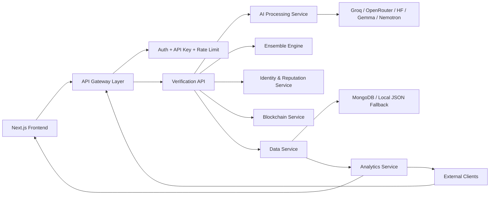

# TruthChain X

TruthChain X is a Global Trust Intelligence Platform: a startup-grade system for content verification, creator reputation, misinformation tracking, predictive trust signals, and blockchain-backed trust proofs.

It is built as a production-oriented monorepo MVP with clear service boundaries, API monetization primitives, and a frontend that reads like a real SaaS product instead of a hackathon toy.

## What the product does

- Verifies text, image, and video-style submissions with a multi-model AI pipeline
- Generates a reusable `Trust Fingerprint` for each piece of content
- Maintains a `Creator Reputation` profile with credibility and risk scoring
- Detects re-uploads by content hash and returns existing verification history
- Tracks misinformation spread, trust evolution, and platform-wide risk signals
- Stores trust proofs on blockchain, with a testnet-ready write path and safe queued fallback
- Exposes partner-ready APIs with API keys, JWT auth, rate limiting, and usage tracking
- Supports free, pro, and enterprise API plans

## Product surface

### UI pages

- `/` and `/dashboard` -> live verification dashboard
- `/analytics` -> platform analytics and global risk monitoring
- `/reports` -> executive-style reports and enterprise readiness view
- `/api-hub` -> API product catalog, auth model, and usage view

### API surface

- `POST /api/verify-content`
- `POST /api/analyze`
- `POST /api/verify`
- `GET /api/trust/{hash}`
- `GET /api/user/{id}`
- `POST /api/user/update-score`
- `GET /api/trust-score/{id}`
- `GET /api/creator-reputation/{id}`
- `POST /api/bulk-verify`
- `GET /api/analytics/report`
- `POST /api/auth/demo-login`

## Production architecture



## Current service boundaries in the repo

Even though this repo runs as one deployable Next.js application, the code is already split along microservice lines so it can be extracted cleanly:

- `app/api/*` -> API gateway and platform endpoints
- `server/controllers/*` -> request orchestration and response shaping
- `server/services/pipeline/*` -> content-processing pipeline
- `server/services/cache/*` -> in-memory dedupe and hot-result caching
- `server/services/identity/*` -> creator reputation updates
- `server/services/blockchain/*` -> smart-contract integration boundary
- `server/middlewares/*` -> validation and rate limiting
- `server/models/*` -> database model definitions
- `services/ai/*` -> provider-specific AI adapters
- `services/ensemble.ts` and `services/ensembleEngine.ts` -> ensemble decision logic
- `lib/verification-service.ts` -> compatibility wrapper into the new server pipeline
- `lib/reputation.ts` -> creator identity and reputation logic
- `lib/blockchain.ts` -> blockchain write and retrieval boundary
- `lib/db.ts` -> persistence boundary
- `lib/analytics.ts` -> reporting and platform analytics boundary
- `lib/platform.ts` -> auth, API plans, rate limiting, and usage tracking

## Folder structure

```text
app/
  api/
    analytics/report/route.ts
    auth/demo-login/route.ts
    bulk-verify/route.ts
    creator-reputation/[id]/route.ts
    creator-score/route.ts
    trust-score/[id]/route.ts
    trust-score/route.ts
    verify-content/route.ts
    verify/route.ts
    analyze/route.ts
    history/route.ts
    trust-feed/route.ts
  analytics/page.tsx
  api-hub/page.tsx
  dashboard/page.tsx
  reports/page.tsx
  page.tsx
components/
  dashboard/
  layout/
  pages/
  upload/
contracts/
  TruthChainRegistry.sol
data/
  api-keys.json
  api-usage.json
  creators.json
  verifications.json
lib/
  analytics.ts
  blockchain.ts
  db.ts
  embeddings.ts
  hashing.ts
  platform.ts
  reputation.ts
  verification-service.ts
services/
  ai/
  ensemble.ts
  ensembleEngine.ts
server/
  config/
  controllers/
  middlewares/
  models/
  routes/
  services/
    ai/
    blockchain/
    cache/
    ensemble/
    identity/
    pipeline/
  utils/
```

## Multi-AI orchestration

### Model roles

- `GROQ` -> fast triage and summarization
- `OpenRouter / GPT OSS` -> reasoning and explanation generation
- `Gemma` -> fact-checking and contextual validation for text
- `HuggingFace` -> image and deepfake risk signals
- `NVIDIA Nemotron` -> embeddings and similarity matching

### Pipeline

1. User submits content
2. Content is hashed and preprocessed
3. Relevant AI providers run in parallel
4. Ensemble engine combines signals into a final trust result
5. Creator reputation updates
6. Blockchain proof is stored or queued
7. Record is cached for immediate re-upload detection
8. Thin API controllers return structured JSON responses

## Authentication and monetization

TruthChain X now supports platform-style access control:

- API keys for external integrations
- JWT bearer tokens for authenticated clients
- free, pro, and enterprise plan tiers
- per-plan rate limiting
- usage tracking for monetization experiments

### Demo API keys

- Free: `tcx_free_demo_key`
- Pro: `tcx_pro_demo_key`
- Enterprise: `tcx_enterprise_demo_key`

### Demo JWT

Generate one with:

```bash
curl -X POST http://localhost:3000/api/auth/demo-login \
  -H "Content-Type: application/json" \
  -d "{\"role\":\"enterprise\",\"plan\":\"enterprise\"}"
```

## API reference

### `POST /api/verify-content`

Headers:

- `x-api-key: tcx_free_demo_key`

Body:

```json
{
  "type": "text",
  "content": "Breaking: Scientists confirm drinking silver solution eliminates all viruses in 24 hours.",
  "fileName": "claim.txt",
  "creatorId": "creator_demo",
  "creatorName": "Demo Creator",
  "demoMode": true
}
```

### `GET /api/trust-score/{id}`

Fetch a stored trust fingerprint by content hash.

### `GET /api/trust/{hash}`

Backend-first trust lookup route that returns trust score, fingerprint, consensus, and blockchain status.

### `GET /api/user/{id}`

Returns the creator profile and identity-backed reputation record.

### `POST /api/user/update-score`

Applies a reputation update payload for internal tools or admin workflows.

### `GET /api/creator-reputation/{id}`

Fetch creator reputation and recent content history.

### `POST /api/bulk-verify`

Requires at least the `pro` plan.

```json
{
  "items": [
    {
      "type": "text",
      "content": "Miracle cure goes viral",
      "fileName": "claim-a.txt"
    }
  ]
}
```

### `GET /api/analytics/report`

Requires the `enterprise` plan. Returns platform totals, risk distribution, trust trends, top risky creators, and monetization telemetry.

## Setup

1. Install dependencies:

```bash
npm install
```

2. Create env file:

```bash
copy .env.example .env.local
```

3. Optional: seed demo data

```bash
npm run seed
```

4. Start the app:

```bash
npm run dev
```

## Environment variables

See [.env.example](C:\Programs\codex\TruthChain%20AI\.env.example) for the full template.

Key groups:

- AI provider keys
- blockchain RPC and wallet config
- MongoDB connection
- JWT secret
- demo API keys
- auth mode toggles

## Deployment plan

### Frontend

- Deploy the Next.js app to Vercel for the product UI

### Backend

- Run the same app or extract the API layer into a Node container
- Put it behind a reverse proxy or API gateway
- Move rate limiting and usage tracking to Redis/Postgres for production

### Database

- MongoDB Atlas for content, creators, and trust history

### Blockchain

- Polygon Amoy testnet for MVP
- Move to Polygon mainnet or an L2 when production economics justify it

### Queues and scale-up path

When traffic grows, extract these services:

1. `verification-service`
2. `reputation-service`
3. `analytics-service`
4. `blockchain-service`
5. `gateway-service`

Then move long-running AI tasks onto a queue such as RabbitMQ or Kafka.

## Security posture

- API key and JWT-based access control
- Plan gating for premium endpoints
- Request rate limiting
- Environment-based secret storage
- Structured usage tracking for auditing and billing

## Validation

- `npm run build`
- `npm run typecheck`
- `npm run chain:compile`

## Demo flow

1. Open `/`
2. Paste the fake health claim and keep `Demo Mode ON`
3. Click `Verify Content`
4. Show Trust Fingerprint, creator reputation, consensus, and blockchain proof
5. Navigate to `/analytics` and `/reports` for platform-level storytelling
6. Open `/api-hub` to show monetization and partner integration capability

## Why this is startup-ready

- It now has a real product surface, not just a single flashy page
- The API is structured for partners and monetization
- The codebase is already segmented by service boundary
- Identity, analytics, and usage tracking are part of the core system
- The architecture can evolve into microservices without rewriting the product
