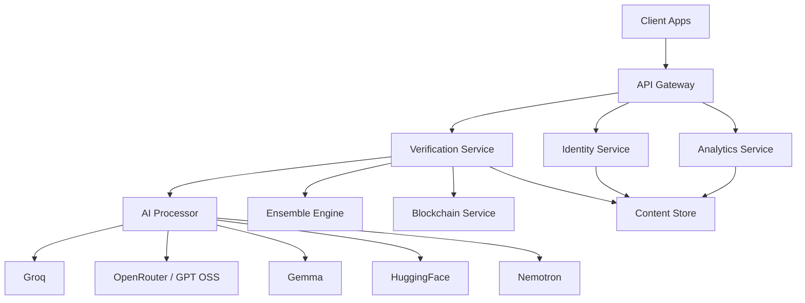

# TruthChain-X Production Architecture

## Service map

## Extraction path

The current Next.js monorepo already maps cleanly to a production service split:

1. `app/api/*` -> API Gateway
2. `lib/verification-service.ts` -> Verification Service
3. `services/ai/*` -> AI Processing Service
4. `services/ensembleEngine.ts` -> Ensemble Engine
5. `lib/reputation.ts` -> Identity and Reputation Service
6. `lib/blockchain.ts` -> Blockchain Service
7. `lib/analytics.ts` -> Analytics Service
8. `lib/db.ts` -> Data Service

## Recommended production deployment

- Vercel: frontend and light API traffic
- Dockerized backend service: heavy verification and enterprise APIs
- MongoDB Atlas: trust history, users, creators, content
- Redis: rate limiting, caching, ephemeral queues
- RabbitMQ or Kafka: async verification jobs
- Polygon Amoy or Polygon mainnet: blockchain proofs

## Scaling plan

- Move long-running AI jobs off request threads
- Cache phishing risk signatures by content hash
- Add vector storage for embeddings similarity
- Replace file-backed usage tracking with Redis or Postgres
- Add observability with OpenTelemetry and structured logs
